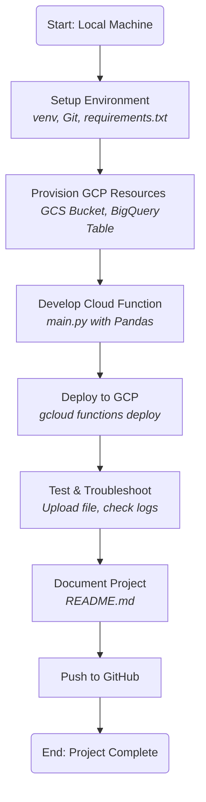
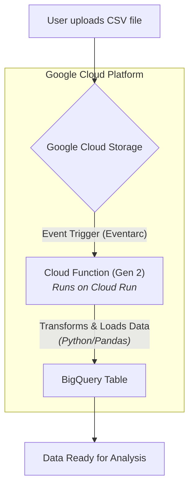

# GCP Serverless Data Pipeline 🚀

[](https://cloud.google.com/serverless)
[](https://www.python.org/downloads/release/python-3110/)
[](https://opensource.org/licenses/MIT)

## 📋 Project Overview

This project implements an automated, serverless data pipeline on Google Cloud Platform (GCP). The pipeline ingests CSV data uploaded to Google Cloud Storage (GCS), triggers a Python-based transformation process using a **Gen 2 Cloud Function (running on Cloud Run)**, and loads the cleaned, structured data into **Google BigQuery**.

This project serves as a practical demonstration of a modern, event-driven, serverless ETL (Extract, Transform, Load) workflow, a foundational pattern in cloud data engineering.

**(You should insert a diagram or screenshot of the GCP architecture here!)**
<!-- Example:  -->

## 🔄 Project Workflows

The project was executed following a structured development plan and results in an automated functional data flow.

### Development Workflow

This diagram outlines the step-by-step process used to build and deploy the pipeline.



### Functional Workflow

This diagram illustrates how data moves through the live, automated pipeline.



## ⭐ Core Features

- **Automated Trigger**: Event-driven execution upon new file uploads to a GCS bucket, managed by Eventarc.

- **Serverless Processing**: Utilizes Gen 2 Cloud Functions, executed as containerized applications on Google Cloud Run, for scalable, cost-effective data transformation without managing servers.

- **Data Transformation**: Leverages the pandas library in Python for flexible data manipulation, including cleaning, standardization, and feature derivation.

- **Cloud Data Warehousing**: Loads structured, transformed data into Google BigQuery, making it immediately available for SQL-based analytics.

- **Reproducible Deployment**: The entire cloud function and its dependencies are defined in code and deployed via the gcloud CLI.

## 🛠️ Technology Stack

| Category | Technologies Used |
|----------|------------------|
| Cloud Platform | Google Cloud Platform (GCP) |
| Core Services | GCS, Cloud Functions (Gen 2), Cloud Run, BigQuery, Eventarc, IAM, Cloud Build, Cloud Logging |
| Core Language | Python 3.11 |
| Key Libraries | pandas, google-cloud-storage, google-cloud-bigquery, functions-framework, pyarrow |
| Deployment & Auth | Google Cloud SDK (gcloud), Application Default Credentials (ADC) |
| Version Control | Git & GitHub |

## 📁 Project Structure

```
gcp-data-pipeline/
├── .git/
├── gcp2env/                 # Python virtual environment (in .gitignore)
├── cloud_function_source/   # Source code for the Cloud Function
│   ├── main.py              # The Python function logic
│   └── requirements.txt     # Python dependencies for the function
├── sample_data/
│   └── user_events_input.csv# Sample input data
├── .gitignore
└── README.md                # This file
```

## 🚀 Local Setup & Deployment

### GCP Prerequisites

- **GCP Project**: An active project with billing enabled.
- **Enabled APIs**: Cloud Functions, Cloud Storage, BigQuery, Cloud Build, Eventarc, and Cloud Run APIs.
- **GCS Bucket**: A globally unique GCS bucket created in your desired region.
- **BigQuery**: A BigQuery Dataset created, containing a target Table with a predefined schema.
- **gcloud CLI**: Installed, configured, and authenticated (gcloud auth login, gcloud auth application-default login).

### Deployment Steps

**Clone the Repository:**

```bash
git clone https://github.com/amirulhazym/gcp-serverless-data-pipeline.git
cd gcp-serverless-data-pipeline
```

**Configure the Function:**

Modify cloud_function_source/main.py and update the global variables (TARGET_BIGQUERY_PROJECT_ID, TARGET_DATASET, TARGET_TABLE) to match your GCP setup.

**Deploy the Cloud Function:**

Run the following command from the project root, replacing all placeholders with your specific values.

```powershell
gcloud functions deploy your-function-name `
  --gen2 `
  --runtime python311 `
  --region your-gcp-region `
  --source ./cloud_function_source/ `
  --entry-point process_gcs_csv_to_bq `
  --trigger-event-filters="type=google.cloud.storage.object.v1.finalized" `
  --trigger-event-filters="bucket=your-gcs-input-bucket-name" `
  --memory=512MiB
```

### Testing the Pipeline

1. Upload the sample_data/user_events_input.csv file to your GCS input bucket.
2. **Monitor Logs**: Navigate to Cloud Logging (accessible from the Cloud Run or Cloud Functions UI) to view the execution logs of your function.
3. **Verify Data**: Query the target table in BigQuery to confirm that the transformed data has been successfully loaded.

## 💡 Key Challenges & Learnings

- **Serverless Architecture**: Gained practical experience designing and implementing an event-driven, serverless pipeline, a core pattern in modern data engineering.

- **IAM Permissions**: Mastered the complex but critical process of configuring IAM roles for inter-service communication. A key challenge was granting the correct permissions to the Eventarc and GCS service agents to allow the trigger to be created and events to be published.

- **Dependency Management in the Cloud**: Understood the importance of the pyarrow library for efficient data transfer between pandas and BigQuery. Its absence initially caused deployment failures.

- **Resource Management**: Learned to troubleshoot Cloud Function failures due to memory limits, requiring an increase in the allocated memory during deployment.

- **Data Type Fidelity**: Resolved a common data engineering problem where pandas datetime64[ns] objects needed to be explicitly converted to UTC (datetime64[ns, UTC]) to be correctly interpreted as TIMESTAMP columns by BigQuery.

## 🔮 Future Enhancements

- **Dead-Letter Queue (DLQ)**: Implement a DLQ by routing failed files to a separate "error" GCS bucket for manual inspection.
- **Data Validation**: Integrate a library like Pandera to perform schema and data validation before loading to BigQuery.
- **Monitoring & Alerting**: Set up Cloud Monitoring dashboards and alerts to track pipeline health, such as function execution time and failure rates.
- **Idempotency**: Enhance the function to prevent duplicate data insertion if the same file is processed twice.

## 👤 Author

**Amirulhazym**
- LinkedIn: linkedin.com/in/amirulhazym
- GitHub: github.com/amirulhazym
- Portfolio: amirulhazym.framer.ai
