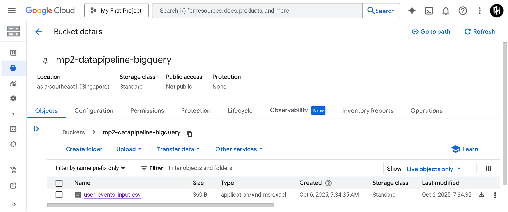

# GCP Serverless Data Pipeline 🚀

[](https://cloud.google.com/serverless)
[](https://www.python.org/downloads/release/python-3110/)
[](https://opensource.org/licenses/MIT)

## 📋 Project Overview

This project implements an automated, serverless data pipeline on Google Cloud Platform (GCP). The pipeline ingests CSV data uploaded to Google Cloud Storage (GCS), triggers a Python-based transformation process using a **Gen 2 Cloud Function (running on Cloud Run)**, and loads the cleaned, structured data into **Google BigQuery**.

This project serves as a practical demonstration of a modern, event-driven, serverless ETL (Extract, Transform, Load) workflow, a foundational pattern in cloud data engineering.

**(You should insert a diagram or screenshot of the GCP architecture here!)**
<!-- Example:  -->

## 🔄 Project Workflows

The project was executed following a structured development plan and results in an automated functional data flow.

### Development Workflow

This diagram outlines the step-by-step process used to build and deploy the pipeline.


### Functional Workflow

This diagram illustrates how data moves through the live, automated pipeline.


## ⭐ Core Features

- **Automated Trigger**: Event-driven execution upon new file uploads to a GCS bucket, managed by Eventarc.

- **Serverless Processing**: Utilizes Gen 2 Cloud Functions, executed as containerized applications on Google Cloud Run, for scalable, cost-effective data transformation without managing servers.

- **Data Transformation**: Leverages the pandas library in Python for flexible data manipulation, including cleaning, standardization, and feature derivation.

- **Cloud Data Warehousing**: Loads structured, transformed data into Google BigQuery, making it immediately available for SQL-based analytics.

- **Reproducible Deployment**: The entire cloud function and its dependencies are defined in code and deployed via the gcloud CLI.

## 🛠️ Technology Stack

| Category | Technologies Used |
|----------|------------------|
| Cloud Platform | Google Cloud Platform (GCP) |
| Core Services | GCS, Cloud Functions (Gen 2), Cloud Run, BigQuery, Eventarc, IAM, Cloud Build, Cloud Logging |
| Core Language | Python 3.11 |
| Key Libraries | pandas, google-cloud-storage, google-cloud-bigquery, functions-framework, pyarrow |
| Deployment & Auth | Google Cloud SDK (gcloud), Application Default Credentials (ADC) |
| Version Control | Git & GitHub |

## 📁 Project Structure

```
gcp-data-pipeline/
├── .git/
├── gcp2env/                 # Python virtual environment (in .gitignore)
├── cloud_function_source/   # Source code for the Cloud Function
│   ├── main.py              # The Python function logic
│   └── requirements.txt     # Python dependencies for the function
├── sample_data/
│   └── user_events_input.csv# Sample input data
├── .gitignore
└── README.md                # This file
```

## 🚀 Local Setup, Execution & Deployment

This section provides a complete, end-to-end guide to get the pipeline running. It covers preparing your local machine, provisioning the cloud infrastructure, deploying the function, and finally, executing the pipeline to process data.

### Step 1: Local Setup & Authentication

Prepare your local machine to interact with your GCP project.

1.  **Clone the Repository:**
    ```bash
    git clone https://github.com/amirulhazym/gcp-serverless-etl-pipeline.git
    cd gcp-serverless-etl-pipeline
    ```

2.  **Configure the gcloud CLI:**
    Set the default project where all resources will be created.
    ```bash
    # Replace with your actual GCP Project ID
    gcloud config set project YOUR_GCP_PROJECT_ID
    ```

3.  **Authenticate Your Credentials:**
    Log in and create Application Default Credentials, allowing your local machine to make authenticated API calls to GCP.
    ```bash
    gcloud auth login
    gcloud auth application-default login
    ```

### Step 2: Provision Cloud Infrastructure

Create the necessary GCS and BigQuery resources that the Cloud Function will interact with.

1.  **Create GCS Bucket:**
    This is the pipeline's entry point. **Note: Bucket names must be globally unique.**
    ```bash
    # Replace with a unique name and your desired region (e.g., asia-southeast1)
    gcloud storage buckets create gs://YOUR-UNIQUE-GCS-BUCKET-NAME --location=YOUR_GCP_REGION
    ```

2.  **Create BigQuery Dataset:**
    This is a container for your tables.
    ```bash
    # Replace with a dataset name like 'pipeline_output'
    bq mk --dataset YOUR_GCP_PROJECT_ID:YOUR_DATASET_NAME
    ```

3.  **Create BigQuery Table with Schema:**
    This command creates the destination table with the precise structure required by the function.
    ```bash
    # Replace with a table name like 'transformed_user_events'
    bq mk --table YOUR_GCP_PROJECT_ID:YOUR_DATASET_NAME.YOUR_TABLE_NAME \
    user_id:STRING,event_timestamp:TIMESTAMP,country_code:STRING,value:FLOAT,is_high_value:BOOLEAN,processing_datetime:TIMESTAMP
    ```

### Step 3: Deployment

Configure the function's code and deploy it to Google Cloud.

1.  **Configure Function Source Code:**
    Open the file `cloud_function_source/main.py` and update the global variables to match the resources you created above.
    ```python
    # === CONFIGURE THESE VALUES IN main.py ===
    TARGET_BIGQUERY_PROJECT_ID = "YOUR_GCP_PROJECT_ID"
    TARGET_DATASET = "YOUR_DATASET_NAME"
    TARGET_TABLE = "YOUR_TABLE_NAME"
    # =========================================
    ```

2.  **Deploy to Cloud Functions:**
    Execute the following command from the project's root directory. This will package, upload, and deploy your function, automatically setting up the GCS trigger.

    **Replace the following placeholders:**
    -   `your-function-name`: A name for your function (e.g., `gcs-to-bq-etl-processor`).
    -   `your-gcp-region`: The **same region** as your GCS bucket.
    -   `your-unique-gcs-bucket-name`: The GCS bucket name from Step 2.

    ```powershell
    gcloud functions deploy your-function-name `
      --gen2 `
      --runtime python311 `
      --region your-gcp-region `
      --source ./cloud_function_source/ `
      --entry-point process_gcs_csv_to_bq `
      --trigger-event-filters="type=google.cloud.storage.object.v1.finalized" `
      --trigger-event-filters="bucket=your-unique-gcs-bucket-name" `
      --memory=512MiB
    ```

### Step 4: Execution & Verification

With everything deployed, trigger the pipeline and verify the result.

1.  **Execute the Pipeline:**
    Upload the sample data file to your GCS bucket using the `gcloud` CLI. This action will trigger the function.
    ```bash
    gcloud storage cp sample_data/user_events_input.csv gs://YOUR-UNIQUE-GCS-BUCKET-NAME/
    ```
    

2.  **Verify the Execution Logs:**
    Check the function's logs in the GCP Console to confirm it ran successfully. You can find these by navigating to `Cloud Functions` > `(your-function-name)` > `LOGS`. Look for a successful completion message.

 
4.  **Verify the Final Data:**
    Query your BigQuery table to see the final, transformed data.
    ```sql
    -- Run this query in the BigQuery UI
    SELECT * FROM `YOUR_GCP_PROJECT_ID.YOUR_DATASET_NAME.YOUR_TABLE_NAME` LIMIT 100;
    ```
    You should see the contents of the CSV file, cleaned and structured according to the Python script's logic. Example:
    

## 💡 Key Challenges & Learnings

- **Serverless Architecture**: Gained practical experience designing and implementing an event-driven, serverless pipeline, a core pattern in modern data engineering.

- **IAM Permissions**: Mastered the complex but critical process of configuring IAM roles for inter-service communication. A key challenge was granting the correct permissions to the Eventarc and GCS service agents to allow the trigger to be created and events to be published.

- **Dependency Management in the Cloud**: Understood the importance of the pyarrow library for efficient data transfer between pandas and BigQuery. Its absence initially caused deployment failures.

- **Resource Management**: Learned to troubleshoot Cloud Function failures due to memory limits, requiring an increase in the allocated memory during deployment.

- **Data Type Fidelity**: Resolved a common data engineering problem where pandas datetime64[ns] objects needed to be explicitly converted to UTC (datetime64[ns, UTC]) to be correctly interpreted as TIMESTAMP columns by BigQuery.

## 🔮 Future Enhancements

- **Dead-Letter Queue (DLQ)**: Implement a DLQ by routing failed files to a separate "error" GCS bucket for manual inspection.
- **Data Validation**: Integrate a library like Pandera to perform schema and data validation before loading to BigQuery.
- **Monitoring & Alerting**: Set up Cloud Monitoring dashboards and alerts to track pipeline health, such as function execution time and failure rates.
- **Idempotency**: Enhance the function to prevent duplicate data insertion if the same file is processed twice.

## 👤 Author

**Amirulhazym**
- LinkedIn: linkedin.com/in/amirulhazym
- GitHub: github.com/amirulhazym
- Portfolio: amirulhazym.framer.ai
